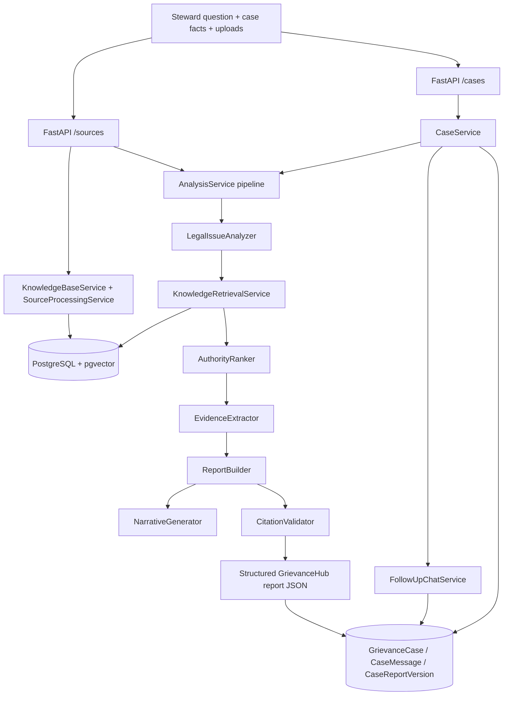

# GrievanceHub Project State

Last updated: 2026-07-06 (Phase 1.4E saved cases API / reopen workflow foundation)

## Architecture



**Stack:** Python 3.14, FastAPI, SQLAlchemy, Alembic, PostgreSQL 16 + pgvector (Docker), OpenAI embeddings (`text-embedding-3-small`), OpenAI chat (`gpt-4o-mini`).

**Indexed approved sources (live DB):** CONTRACT (National Agreement), CIM, ELM — **7 documents, ~1369 embedded chunks**.

**LMOU:** Approved in `AGENTS.md` but **not currently indexed** in the database. Retrieval and gap logic must **not** treat LMOU as available until documents are ingested and embedded.

**Authoritative specs:** Report section requirements in `AGENTS.md` and `app/schemas/report_schema.py` (`REPORT_SECTIONS`, `GrievanceHubReport`). Implementation phases tracked in this document.

---

## Sensitive data and security model (app-wide)

GrievanceHub is a **closed internal steward/admin application**. Only authorized stewards and union officials should have access. **Sensitive information is allowed throughout the app by design** — authorized outputs may intentionally contain sensitive grievance information.

### Surfaces where sensitive data is expected

| Surface | Sensitive data allowed? |
|---------|-------------------------|
| GrievanceHub Analysis Reports | Yes |
| Follow-up Q&A | Yes |
| Saved case workspaces | Yes |
| Generated Step 1/2/3 grievance forms | Yes |
| Exports / downloads (HTML, PDF, DOCX) | Yes |
| Case history | Yes |
| Future RAG outputs (protected-source lane, when authorized) | Yes |

Examples of data that may appear: employee names, EINs/employee IDs, grievance facts, dates, management names, steward names, remedies, citations, and other case-specific or private grievance-related information.

### Security goals (what we protect)

The security goal is **not** to remove sensitive information from authorized steward/admin outputs.

The security goal **is** to:

- Keep unauthorized users out of the app
- Prevent public or anonymous access to case data
- Prevent accidental GitHub commits of private generated outputs
- Prevent storage of case artifacts in public/static folders
- Prevent raw sensitive logging (log metadata only, not narrative bodies or field values)
- Prevent unauthenticated report, form, or export URLs
- Prevent unintended uploads, syncs, deployments, or external transmission of private case artifacts
- Keep reports, forms, exports, and history inside the authenticated case workspace workflow

**Current state:** Export and case routes are development/local-only with an auth stub (`_authorize_export()`). Production authentication and case access controls are planned for Phase 1.7. Phase 1.4 grievance form generation extends the same containment model to generated forms.

**Planning reference:** `data/reports/phase1_4_official_grievance_templates_plan_2026-07-04.md`

---

## Codebase verification (2026-07-01)

**Git:** Local-only repository on branch `master` (Phase 3 merged locally 2026-07-02). **No remote configured** — nothing pushed or uploaded.

**Confirmed present and aligned with documentation:**

| Area | Verification |
|------|----------------|
| Phase 0 retrieval/ranking | `app/retrieval_config.py`, `relevance_utils.py`, `knowledge_retrieval_service.py`, `authority_ranker.py`, `citation_validator.py`, `analysis_service.py` |
| Phase 1 report schema/narratives | `app/schemas/report_schema.py`, `narrative_generator.py`, `report_builder.py` |
| Phase 2 case sessions | `app/services/case_service.py`, `app/api/routes/cases.py`, `app/main.py` (cases router registered), Alembic `a1b2c3d4e5f6_add_grievance_case_tables.py` |
| Phase 3 HTML/PDF export | `app/services/report_export/`, `app/services/report_export_service.py`, `app/api/routes/exports.py`, Jinja templates + `report.css` |
| Regression harness | `tests/fixtures/regression_questions.json` (8 questions), `tests/test_regression_harness.py`, `scripts/regression_report.py`, `scripts/diagnose_regression.py` |
| Live scorecard artifact | `data/reports/regression_scorecard.json` — **8 PASS / 0 PARTIAL / 0 FAIL** (`phase0_iteration2_verification`, 2026-07-01) |
| Phase 0.1 Iteration A | `tests/test_phase0_1_iteration_a.py`, topic-mismatch filters, honest gap disclosure — **verified 2026-07-01** |

---

## Phase 0.1 — Hardening Record (Iteration A)

**Status:** Complete. **Iteration B is not required.** Phase 0.1 hardening is finished; Phase 1 and Phase 2 remain intact.

### Original regression (unchanged)

| Metric | Result |
|--------|--------|
| **PASS** | **8** |
| **PARTIAL** | **0** |
| **FAIL** | **0** |

The eight-question benchmark harness (`tests/fixtures/regression_questions.json`) still scores **8 PASS / 0 PARTIAL / 0 FAIL** after Iteration A changes.

### Iteration A — unseen-question verification highlights

| Question | Outcome | Notes |
|----------|---------|-------|
| Q7 (grievance timeliness) | PASS | Substantive Article 15.2 timeliness language retrieved (“first learned” / filing-deadline excerpts) — **Iteration B not required** |
| Q9 (investigatory interview / representation) | **PARTIAL (expected)** | Governing investigatory-representation authority is **not indexed**; report now prominently discloses `authority_topics_unavailable_in_index: ["investigatory_union_representation"]`; unrelated Article 17 and bargaining-unit-work substitutes **removed** |
| Q10 (established practice) | PASS | LMOU listed under `unindexed_sources_requested`; Article 5 past-practice authorities **retained**; unrelated Article 7.2 and Section 12.7 authorities **removed** |

### Defect repairs (summary)

- **D1 false timeline gap** — eliminated false `issues_without_supporting_authority` flags (e.g. Q2).
- **D2 timeliness depth** — Q7 retrieves grounded Article 15.2 filing-deadline language.
- **D3 representation disclosure** — Q9 surfaces honest `authority_topics_unavailable_in_index` when Weingarten-type sources are absent from the index.
- **D4 LMOU disclosure** — Q5/Q10 list `unindexed_sources_requested: ["LMOU"]` with prominent limitations caveats.
- **D5 irrelevant authorities** — topic-mismatch filtering removes unrelated Article 17, BU-work, Article 7.2, Section 12.7, and similar substitutes while preserving on-topic authorities.

### Files changed (Iteration A)

| File | Changes |
|------|---------|
| `app/retrieval_config.py` | Topic-mismatch / disclosure configuration |
| `app/services/relevance_utils.py` | Past-practice LMOU signals, topic-mismatch clusters, quote-only coverage |
| `app/services/authority_ranker.py` | Topic-mismatch post-filters |
| `app/services/analysis_service.py` | Honest gap metadata passthrough |
| `app/services/legal_issue_analyzer.py` | Representation / LMOU issue signals |
| `app/services/narrative_generator.py` | Prominent limitations for unindexed topics and LMOU |
| `tests/test_phase0_1_iteration_a.py` | **New** — scope, LMOU, representation disclosure, topic mismatch |
| `tests/test_retrieval_gaps.py` | Gap disclosure assertions |

### Tests passed (Iteration A verification)

| Suite | Result |
|-------|--------|
| `tests/test_phase0_1_iteration_a.py` | **25 passed** |
| Non-integration (`pytest tests/ -m "not integration"`) | **68 passed, 1 deselected** |
| Live original 8-question regression | **8 PASS / 0 PARTIAL / 0 FAIL** |

Verification artifacts (local, not committed): `data/reports/phase0_1_iteration_a_results_2026-07-01.md`, `data/reports/phase0_1_iteration_a_final_verification_2026-07-01.md`, `data/reports/phase0_1_local_merge_2026-07-01.md`.

### Phase 1 and Phase 2 — confirmed intact

- **Phase 1 (structured report + narratives):** Report schema, `NarrativeGenerator`, grounded `ReportBuilder` — unchanged except Iteration A gap/disclosure enhancements in narratives and analysis passthrough.
- **Phase 2 (case sessions):** `CaseService`, `/cases/*` API, versioned reports — **not modified** in Iteration A.

### Recommended next phase

**Phase 3.1 — Source coverage / remedy grounding:** Improve upstream retrieval and report depth so live analyses surface distinct remedy authority, richer evidence checklists, and better multi-passage grouping inputs — separate from the completed export layer.

**Phase 4 — Frontend / steward UI:** Build steward-facing case workspace consuming existing `/cases/*` and export routes. Export routes remain local/development-only until authentication is added.

---

## Phase 1.1 — Source Coverage, Remedy Grounding, and Retrieval Stability

**Status:** Complete on branch `phase1-1-source-coverage-remedy` (uncommitted, local-only). Pre-commit steward spot-check passed 2026-07-03. **Not yet committed.**

### Scope delivered

- Honest per-source search coverage (CONTRACT, CIM, ELM) with steward-readable source-gap disclosure
- Actor/action direction filters excluding employee-initiated leave-cancellation passages from management-revocation disputes
- Remedy authority grounded only when explicit relief language survives gates
- Steward-facing export wording repairs (Authority support label, plain-English source gaps, neutral citation-check language)
- **Retrieval-stability blocker fixed:** question-text fallback for direction detection, direction gate in retrieval, dispute-aware CONTRACT backfill, ranker authority-mix floor, CONTRACT pool supplement

### Frozen management-revocation scenario — verified behavior

| Expectation | Result |
|-------------|--------|
| CONTRACT Article 10.5 retained | Yes — advance-leave commitment language (p. 44) |
| CIM Article 31 retained | Yes — information-request language (p. 468) |
| CIM Article 10 p.137 excluded | Yes — employee-cancellation Q&A not retained |
| National Agreement and CIM cited separately | Yes — distinct document names, citations, and source-reference rows |
| ELM coverage | Searched; honest no-match disclosure |
| Remedy authority | None (honest gap) |
| Repeated live stability | **5/5** golden-mix passes |

### Tests passed (Phase 1.1 verification)

| Suite | Result |
|-------|--------|
| `tests/test_phase1_1_source_coverage.py` | **13 passed** |
| `tests/test_phase1_1_retrieval_stability.py` | **13 passed** |
| Non-integration (`pytest tests/ -m "not integration"`) | **175 passed, 1 deselected** |
| 8-question live regression | **8 PASS / 0 PARTIAL / 0 FAIL** |
| 5-run live regeneration stability | **5/5 PASS** |
| Unseen Q9 (representation) / Q10 (past practice) | **PASS** |

### Steward review artifacts (local)

- `data/reports/phase1_1_live_synthetic_report_2026-07-02.html`
- `data/reports/phase1_1_live_synthetic_report_2026-07-02.pdf`
- `data/reports/phase1_1_source_coverage_results_2026-07-02.json`
- `data/reports/phase1_1_source_coverage_results_2026-07-02.md`

**Dale's feedback (2026-07-03):** Report looked pretty good after wording/stability repairs.

### Recommended next phase

**Phase 2+ roadmap (not started):** Add arbitrations, LMOU indexing, supervisor manuals, follow-up Q&A on saved cases, and Step 1/2/3 grievance form generation — after Phase 1.1 is committed.

---

## Phase 1.2A — Case Workspace and Report History Foundation

**Status:** Complete on branch `phase1-2-case-workspace-history` (committed locally 2026-07-04). Alembic `b2c3d4e5f6a7` adds denormalized `retrieval_gaps`, `source_coverage_audit`, and `report_summary` on `case_report_versions`; workspace aggregate endpoint and explicit `POST /cases/{uuid}/reports/regenerate` route.

**Prerequisite for Phase 1.3:** Follow-up Q&A loads saved report versions and history columns from this foundation.

---

## Phase 1.3 — Follow-Up Q&A Grounded in Saved Cases/Reports

**Status:** Complete on branch `phase1-3-followup-qa` (committed locally 2026-07-04). Commit `b3bc528a7d77be5dfe2cbf4709eade0975effd9e` — `feat: add Phase 1.3 follow-up Q&A`.

### Scope delivered

- Steward follow-up Q&A grounded in saved case/report workspace (no automatic full report regeneration)
- Dedicated follow-up endpoints separate from legacy message append + regen
- Grounding package from saved `CaseReportVersion` (report JSON, gaps, audit, authorities, case facts, uploads metadata, prior follow-up thread)
- Citation post-validation against saved report excerpts; gap and remedy disclosures in response
- Follow-up user + assistant messages persisted under same case history via `case_messages.message_metadata`

### Endpoints added

| Method | Route | Behavior |
|--------|-------|----------|
| `POST` | `/cases/{case_uuid}/followups` | Steward follow-up question → grounded answer; persists user + assistant messages; **does not** call `generate_report_version()` |
| `GET` | `/cases/{case_uuid}/followups` | Lists follow-up thread with linked report version metadata |

### Report regeneration (unchanged / explicit)

| Path | Behavior |
|------|----------|
| Normal follow-up Q&A | **Does not** create a new `CaseReportVersion`; **does not** call `generate_report_version()` |
| `POST /cases/{case_uuid}/reports/regenerate` | Explicit full-pipeline regeneration → new immutable report version |
| `POST /cases/{case_uuid}/messages` | Legacy path — still appends message **and** regenerates report (deferred behavior change to Phase 1.3 slice 2) |

When the steward introduces material new facts, follow-up may set `requires_report_regen: true` and suggest `regenerate_report` — **never** auto-regenerates.

### Grounding and history

- Default report version: **latest** saved version; optional `report_version` pins a specific version
- Answers use saved report sections, `retrieval_gaps`, `source_coverage_audit`, ranked authorities, evidence checklist, and conversation context — not a fresh retrieval/ranker pass
- Follow-up history listable via `GET /followups` and visible in case workspace messages

### Files changed (Phase 1.3)

| File | Role |
|------|------|
| `app/schemas/follow_up_schema.py` | Request/response/citation models |
| `app/services/follow_up_chat_service.py` | Grounding builder, LLM answer, citation validation |
| `app/services/case_service.py` | `add_follow_up_exchange()`, `get_grounding_report_version()`, follow-up message helpers |
| `app/api/routes/cases.py` | `/followups` routes |
| `tests/test_follow_up_chat.py` | Unit tests (mocked LLM) |
| `tests/test_case_api.py` | Follow-up API route tests |

**Not added in Phase 1.3:** Step 1/2/3 grievance form generation, arbitration ingestion, LMOU ingestion, supervisor-manual ingestion, production auth/security layer, supplemental corpus retrieval in follow-up.

### Tests passed (Phase 1.3 verification)

| Suite | Result |
|-------|--------|
| Targeted (`tests/test_follow_up_chat.py`, `tests/test_case_api.py`) | **28 passed** |
| Non-integration (`pytest tests/ -m "not integration"`) | **207 passed, 1 deselected** |

All LLM-dependent tests use injected `llm_callable` mocks or patched service calls — **no live OpenAI calls** during tests or pre-commit review.

Verification artifacts (local, not committed): `data/reports/phase1_3_followup_qa_implementation_2026-07-04.md`, `data/reports/phase1_3_followup_qa_precommit_review_2026-07-04.md`.

### Recommended next phase

**Phase 1.4 — Official Step 1/2/3 grievance template generation** (planned, not started). See planning report below.

---

## Phase 1.4 — Official Step 1/2/3 Grievance Template Generation (planned)

**Status:** Phase 1.4A (template registry foundation) committed locally (`bcc852c`); template assets refactored to `app/assets/grievance_templates/` (`50019c9`); Phase 1.4B (draft form builder foundation) committed locally (`6f84479`); Phase 1.4C (case step progression foundation) committed locally (`1a0b657`); Phase 1.4D (case step timeline / draft history database persistence) on branch `phase1-4D-persist-case-step-timeline` — **not committed** (awaiting review); Phase 1.4E (saved cases API / reopen workflow foundation) implemented on branch `phase1-4E-saved-cases-reopen-api` — **not committed** (awaiting review).

**Product decision:** Official grievance form generation is scheduled **before** the Sensitive RAG Security Gate because it is core steward workflow functionality.

**Phase 1.4A delivered (foundation only):**

- Static Python registry: `app/services/grievance_template_registry.py` + `app/schemas/grievance_template_schema.py`
- Local 300 Form 79-1 registered as **`step_2_appeal`** with Step 1 usage **`unconfirmed_pending_steward_confirmation`** and Step 3 **`deferred_separate_form_required`**
- **Blank template assets:** `app/assets/grievance_templates/` (committed app assets; not under `data/`)
- **Generated filled forms:** `data/generated/forms/`, `data/case_forms/` (gitignored runtime output only)
- Config paths: `GRIEVANCE_TEMPLATE_DIR` (`app/assets/grievance_templates/`), `GENERATED_FORM_OUTPUT_DIR`, `CASE_FORM_OUTPUT_DIR`
- `.gitignore` hardened for generated filled forms; exception for blank template PDFs under `app/assets/grievance_templates/`
- Tests: `tests/test_grievance_template_registry.py` (18 passed)

**Phase 1.4B delivered (draft builder foundation only):**

- Draft schemas: `app/schemas/grievance_form_draft_schema.py` — draft status, field values, provenance, validation, page plan, exact-template mapping metadata
- Draft builder: `app/services/grievance_form_draft_builder.py` — deterministic draft assembly from registered template + synthetic/case-like input (no OpenAI, no export)
- Local 300 exact-template field mappings (official label, page, section, required/protected flags) for future official PDF export
- Never-invent enforcement for protected fields; steward overrides tracked as `steward_override` provenance
- Default page plan pages 1–2; optional page 3 overflow only when requested/needed
- Report-first drafting: `GrievanceFormDraftReportContent` (primary prefill) and `GrievanceFormDraftFollowUpContext` (secondary); raw uploads/concern are case context only
- Tests: `tests/test_grievance_form_draft_builder.py`

**Phase 1.4C delivered (case step progression foundation only):**

- Step progression schemas: `app/schemas/case_step_progression_schema.py` — step types/statuses, outcomes, timestamped timeline events, form draft history records
- Step progression service: `app/services/case_step_progression_service.py` — in-memory same-case Step 1 → Step 2 → Step 3 lifecycle, decision/outcome capture, close/reopen, appeal transitions, draft history linkage
- Same `case_uuid` preserved across steps, reopen, and appeal — prior close/outcome history is append-only (never deleted or overwritten)
- Timestamped case timeline with oldest-first and newest-first ordering helpers
- Step 2 draft integration wraps Phase 1.4B builder (`build_step_form_draft`) with case/step/report/follow-up context and history events
- Step 1 template: **not available** (`unconfirmed_pending_steward_confirmation`); Step 3 template: **deferred** (`deferred_separate_form_required`); only Step 2 Local 300 Form 79-1 is buildable
- Tests: `tests/test_case_step_progression.py` (23 passed, synthetic data only)
- **Persistence deferred to 1.4D:** in-memory foundation only in 1.4C

**Phase 1.4D delivered (case step timeline database persistence only):**

- SQLAlchemy models: `CaseStep`, `CaseStepOutcome`, `CaseTimelineEventRecord`, `CaseFormDraftRecord` in `app/database/models.py`
- Alembic migration `c4d5e6f7a8b9` — tables `case_steps`, `case_step_outcomes`, `case_timeline_events`, `case_form_draft_records`
- Persistence service: `app/services/case_step_progression_persistence_service.py` — create/get steps, outcomes, close/reopen, Step 1 → Step 2 → Step 3 transitions, timeline events (oldest/newest-first), form draft history records
- Same `case_uuid` preserved across steps, reopen, and appeal — prior close/outcome/timeline history is append-only in the database
- Phase 1.4C in-memory service/schemas/tests remain intact alongside persistence layer
- Foreign keys to `grievance_cases`, `case_steps`, and `case_report_versions` where straightforward; `prior_step_outcome_uuid` stored as string reference (no circular FK)
- Step 1 template: **not available**; Step 3 template: **deferred**; only Step 2 Local 300 Form 79-1 is buildable
- Tests: `tests/test_case_step_progression_persistence.py` (17 passed with PostgreSQL; skipped when DB unavailable)
- **Not added:** steward editing UI, approve/export, PDF/DOCX generation, final filled-form disk output

**Phase 1.4E delivered (saved cases API / reopen workflow foundation only):**

- Saved case schemas: `app/schemas/saved_case_schema.py` — list/detail summaries, available actions, open/reopen requests/responses, timeline response
- Saved case service: `app/services/saved_case_service.py` — list/filter/search saved cases by last activity, unified `open_case` / `reopen_case` (manual UI and AI command share same backend), timeline retrieval
- API routes (registered before `/{case_uuid}` to avoid shadowing): `GET /cases/saved`, `GET /cases/saved/{case_uuid}`, `POST /cases/saved/{case_uuid}/open`, `POST /cases/saved/{case_uuid}/reopen`, `GET /cases/saved/{case_uuid}/timeline`
- Reopen is idempotent when already open (no duplicate timeline event); closed cases require `reopen_case` (not `open_case`)
- Reopen persists `case_reopened` timeline event via Phase 1.4D persistence + syncs `GrievanceCase.status`
- Saved case list ordered by last timeline activity (newest-first default); filters by workspace status and current step
- **UI:** polished saved-cases frontend deferred; backend ready for clickable case rows/cards and future AI commands
- Tests: `tests/test_saved_cases_api.py`, `tests/test_saved_case_service.py` (26 passed)
- **Not added:** PDF/DOCX export, source ingestion, polished steward UI, OpenAI integration

**Not yet implemented:** steward editing UI, approve/export, PDF/DOCX generation, final filled-form disk output, production auth for saved-case routes.

**Scope (summary):** Template registry (Step 1/2/3), field mapping from saved case/report (no report regeneration), same-case step progression with outcomes and reopenable history, draft → validate → approve → export (PDF/DOCX), versioned forms tied to case step and report version, protected storage under `data/generated/forms/` and `data/case_forms/`.

**Sensitive-data alignment:** Generated forms follow the **app-wide sensitive-data policy** (see above). Forms may contain names, EINs, facts, remedies, and citations — that is expected for official filing. Security controls target unauthorized access, accidental commits, public/static exposure, and raw logging — not removal of sensitive content from authorized outputs.

**Planning artifact:** `data/reports/phase1_4_official_grievance_templates_plan_2026-07-04.md`

**Deferred after Phase 1.4:** Sensitive RAG Security Gate (Phase 1.7+), arbitration/settlement ingestion (Phase 1.6+), LMOU indexing, supervisor-manual ingestion, follow-up `POST /messages` default change (Phase 1.3 slice 2).

---

## Phase 3 — HTML/PDF Report Export

**Status:** Complete (2026-07-02). Read-only export layer merged to `master` locally. No changes to retrieval, ranking, narratives, or case versioning logic.

### Capabilities

| Export | Route |
|--------|-------|
| HTML preview (latest) | `GET /cases/{case_uuid}/export/preview` |
| HTML download (latest) | `GET /cases/{case_uuid}/export/html` |
| PDF download (latest) | `GET /cases/{case_uuid}/export/pdf` |
| HTML preview (version) | `GET /cases/{case_uuid}/versions/{version_number}/export/preview` |
| HTML download (version) | `GET /cases/{case_uuid}/versions/{version_number}/export/html` |
| PDF download (version) | `GET /cases/{case_uuid}/versions/{version_number}/export/pdf` |

- Consumes saved `CaseReportVersion.report_data` (AnalysisService wrapper) — **never** re-runs pipeline.
- Self-contained HTML with embedded local CSS; PDF via WeasyPrint in memory.
- Jinja2 autoescape + StrictUndefined; deny-by-default PDF URL fetcher.
- Steward-facing presentation normalizers: citation hierarchy, dispute-frame prose, Quick Assessment dedupe, safe quote truncation, grouped multi-page citations, and Source References aggregation (`distinct authorities` vs `retrieved passages`).

### Windows dependencies

- MSYS2 (`C:\msys64`) with `mingw-w64-x86_64-pango`
- Python: `Jinja2==3.1.6`, `weasyprint==69.0`
- `WEASYPRINT_DLL_DIRECTORIES` **not required** on verified Windows setup (Pango detected natively after MSYS2 install)

### Tests (Phase 3 final verification — 2026-07-02)

| Suite | Result |
|-------|--------|
| Phase 3 export tests | **76 passed** |
| PDF tests skipped | **0** |
| Non-integration (`pytest tests/ -m "not integration"`) | **144 passed, 1 deselected** |

Verification artifacts (local, not committed): `data/reports/phase3_live_synthetic_report_final_2026-07-01.html`, `data/reports/phase3_live_synthetic_report_final_2026-07-01.pdf`, `data/reports/phase3_final_visual_qa_2026-07-02.md`, `data/reports/phase3_final_micro_cleanup_2026-07-02.md`.

### Recommended next phase

**Phase 3.1 — Source coverage / remedy grounding** (upstream accuracy): deepen live retrieval/report content — remedy authority coverage, evidence checklists, and passage diversity — without further export-layer changes unless a new presentation defect is found.

---

## Phase 0 — Final Stabilization Record

**Status:** Complete. Bounded repair loop exhausted (initial repair + Iteration 1 + Iteration 2). **No further Phase 0 implementation or regression cycles are planned.**

### Final regression scorecard

| Metric | Baseline | After initial repair | Iteration 1 | **Final (Iteration 2 verified)** |
|--------|----------|----------------------|-------------|-------------------------------------|
| **PASS** | 0 | 6 | 7 | **8** |
| **PARTIAL** | 5 | 2 | 1 | **0** |
| **FAIL** | 3 | 0 | 0 | **0** |

**Per-question final result (all PASS):**

| Q | Topic (summary) | Ranked authorities | Citation validation |
|---|-----------------|-------------------|---------------------|
| Q1 | Annual leave cancellation + information request | 3 | Passed |
| Q2 | Seven-day suspension without prior discipline | 7 | Passed |
| Q3 | Overtime list bypass (seniority) | 8 | Passed |
| Q4 | Supervisor performing BU work | 3 | Passed |
| Q5 | Schedule change with one-day notice | 7 | Passed |
| Q6 | Unsafe equipment / safety inspection | 2 | Passed |
| Q7 | Probationary termination + denied information | 4 | Passed |
| Q8 | Steward records / interview access denied | 3 | Passed |

**Verification method:** Live pipeline via FastAPI `TestClient` (in-process, no Uvicorn). Scorecard artifact: `data/reports/regression_scorecard.json` (`generated_at`: 2026-07-01T14:35:37Z, `finished_at`: 2026-07-01T14:50:13Z).

**Baseline before repair:** Q1–Q4 PARTIAL, Q5–Q6 FAIL, Q7–Q8 PARTIAL.

### Root causes identified

1. **False direction penalties** — `_frame_action_terms` tokenized full dispute-frame sentences (`employee`, `leave`, `approved`, …), penalizing governing chunks.
2. **Per-issue pool starvation** — Narrow issue keywords failed combined-score gate even when embedding similarity matched relevant CONTRACT/CIM text (Q1, Q5, Q6 returned **0** merged chunks).
3. **No global fallback retrieval** — Full-question embedding search was not merged when per-issue pools were empty.
4. **False retrieval gaps** — `missing_source_types` compared ranked authorities to `possible_sources` (often all four types), marking ELM/LMOU missing even when CONTRACT/CIM sufficed.
5. **Dispute frame corruption** — `_resolve_dispute_frame` briefly stringified dict frames, breaking direction scoring (fixed mid-cycle).
6. **Relevant content exists in DB** — Keyword probes confirmed governing text for failed scenarios; failures were scoring/gates, not absent index content.

### All files changed during Phase 0

**Created:**

| File | Purpose |
|------|---------|
| `app/services/narrative_generator.py` | Grounded report narratives (Phase 1; present before final Phase 0 pass) |
| `app/services/case_service.py` | Case sessions and versioned reports (Phase 2) |
| `app/api/routes/cases.py` | `/cases/*` REST API (Phase 2) |
| `scripts/diagnose_regression.py` | Full pipeline diagnostic per benchmark question |
| `scripts/regression_report.py` | Live scorecard + authority listing |
| `tests/fixtures/regression_questions.json` | Eight benchmark questions |
| `tests/test_relevance_phase0.py` | Direction, gate, global-keyword unit tests |
| `tests/test_narrative_generator.py` | Narrative generator unit tests |
| `tests/test_regression_harness.py` | `score_report_completeness` + live smoke |
| `tests/test_case_service.py` | Case service logic tests |
| `tests/test_retrieval_gaps.py` | Retrieval gap logic tests |
| `tests/test_authority_ranker_filters.py` | Coverage-floor unit tests (Iteration 2) |
| `pytest.ini` | Registers `integration` mark |
| `data/reports/regression_diagnosis.json` | Diagnostic output (generated) |
| `data/reports/regression_scorecard.json` | Scorecard output (generated) |

**Modified:**

| File | Phase | Changes |
|------|-------|---------|
| `app/retrieval_config.py` | 0 | `MIN_COMBINED_RETRIEVAL_SCORE=0.30`, `EMBEDDING_FALLBACK_THRESHOLD=0.68`, per-issue/ranker caps, direction/substantive weights |
| `app/services/relevance_utils.py` | 0 | Dispute-frame signals, `passes_retrieval_gate`, global keyword max-scoring, per-issue pool merge, safety query expansion; **Iter 1:** `build_issue_type_backfill_queries`; **Iter 2:** `extract_grounded_quote_snippet` |
| `app/services/legal_issue_analyzer.py` | 0 | `dispute_frame`, `information_rights_issues`, synonyms, `known_facts`, cache invalidation |
| `app/services/knowledge_retrieval_service.py` | 0 | Per-issue pools, global fallback, indexed source types, retrieval gaps; **Iter 1:** `_backfill_empty_issue_pools`, `_append_passing_chunks_to_pool` |
| `app/services/authority_ranker.py` | 0 | Dispute frame in prompt, direction post-filters, multi-issue coverage gaps; **Iter 2:** `_promote_per_issue_coverage_floor` |
| `app/services/citation_validator.py` | 0 | Validates all authority report sections |
| `app/services/analysis_service.py` | 0/1 | Retrieval gaps from `all_chunks`, dispute frame fix, gap/metadata passthrough |
| `app/schemas/report_schema.py` | 1 | Pydantic models + provenance |
| `app/services/report_builder.py` | 1 | Full report via `NarrativeGenerator`; no static tips/remedies |
| `app/services/legal_issue_identifier.py` | 1 | Dispute frame + `known_facts` in prompt |
| `app/services/evidence_extractor.py` | 0 | Issue context in prompt (minor) |
| `app/api/routes/sources.py` | 2 | Optional `case_uuid`; passes retrieval metadata to report |
| `app/main.py` | 2 | Registers cases router |

**Confirmation:** No benchmark-specific hard-coding (no fixed articles, pages, questions, or expected quotes).

### Major retrieval and ranking fixes completed

- **Direction scoring:** Phrase/action-verb signals instead of generic frame tokens; reduced false penalties on leave/schedule/safety chunks.
- **`passes_retrieval_gate()`:** Pass on combined score **or** strong embedding (≥0.68) **or** embedding + substantive content (≥0.25).
- **Global fallback retrieval:** Full question + expanded queries merged into best-matching issue pool when per-issue pools are thin.
- **Global keyword max-scoring:** Chunks scored with both issue-specific and question-level keywords; best score wins.
- **Retrieval gap repair:** `found_source_types` from retrieval pool (`all_chunks`); `missing_source_types` only for indexed types with zero retrieved chunks; LMOU excluded when not indexed.
- **Substantive bonus:** Trigger lowered from 0.5 to 0.25 on substantive score.
- **Safety query expansion:** Token-driven safety/inspection queries when issue text contains safety-related terms (general list, not question-specific).
- **Iteration 1 — issue-type empty-pool backfill:** After global fallback, empty decomposed-issue pools receive a second retrieval pass using general issue-type query templates; backfilled chunks tagged with `matched_issue_ids`.
- **Iteration 2 — ranker per-issue coverage floor:** After LLM ranking + post-filters, `_promote_per_issue_coverage_floor` promotes one gated candidate per uncovered decomposed issue (respects direction, grounding, citation, and relevance gates; no low-quality promotion).

### All tests passed

| Suite | Result | Notes |
|-------|--------|-------|
| Phase 0 focused | **15 passed** | `tests/test_authority_ranker_filters.py` (coverage floor) + `tests/test_relevance_phase0.py` |
| Full unit suite | **39 passed, 1 skipped** | `pytest tests/ -v` (prior full run) |
| Live regression harness | **8 PASS / 0 PARTIAL / 0 FAIL** | `RUN_REGRESSION=1 pytest tests/test_regression_harness.py::test_regression_live_pipeline_smoke` |

Test inventory (46 test functions across 10 test modules): `test_authority_ranker_filters` (4), `test_relevance_phase0` (13), `test_retrieval_gaps` (2), `test_regression_harness` (5), `test_case_service` (6), `test_narrative_generator` (5), `test_knowledge_retrieval_scoring` (2), `test_report_builder_inclusion` (2), `test_citation_validator` (2), `test_relevance_utils` (5). One integration test skipped unless `RUN_REGRESSION=1`.

### Known limitations (non-blocking)

- Some questions still have **empty report authority categories** (e.g. Q7 lacks dedicated remedy/timeline/union_supporting sections) even though the completeness rubric passes with ≥2 ranked authorities, key violations, zero gap burden, and passed citation validation.
- **Converted-regular / probationary nuance** for Q7 is not yet retrieved as a dedicated governing authority (information-rights and management-limiting authorities pass the rubric).
- **LMOU not indexed** — gap logic correctly excludes it; local provisions cannot be retrieved until ingestion.
- **ELM** is indexed but rarely surfaces as top authority for NPMHU benchmark questions; not a regression failure.
- Regression rubric measures **completeness and grounding**, not legal conclusion quality or steward-facing prose depth.

### Protected behavior — do not change without a verified defect

Future phases (3+) must **not** alter the following unless a new defect is reproduced on the live regression harness and fixed with general (non-benchmark-specific) logic:

| Protected area | Location | Rationale |
|----------------|----------|-----------|
| Relevance gate thresholds | `app/retrieval_config.py` | Baseline for 8/8 PASS scorecard |
| `passes_retrieval_gate()` OR-logic | `app/services/relevance_utils.py` | Prevents per-issue pool starvation |
| Direction scoring (phrase/action signals) | `app/services/relevance_utils.py` | Fixed false penalties on governing chunks |
| Per-issue pools + global fallback + issue-type backfill | `app/services/knowledge_retrieval_service.py` | Ensures chunks reach ranker for all issue types |
| `_promote_per_issue_coverage_floor` | `app/services/authority_ranker.py` | Q7 final PASS depends on per-issue coverage |
| Retrieval gap logic (`found_source_types` / indexed-only `missing_source_types`) | `knowledge_retrieval_service.py`, `analysis_service.py` | Eliminates false ELM/LMOU gap flags |
| `score_report_completeness` rubric | `tests/test_regression_harness.py` | Regression contract for PASS/PARTIAL/FAIL |
| Eight benchmark questions | `tests/fixtures/regression_questions.json` | Stable regression baseline |
| Approved source types only | `AGENTS.md`, providers | CONTRACT, CIM, ELM, LMOU — no MRS/JCAM/Step 4/etc. |
| No grievance-type hard-coding | All pipeline services | General issue-aware logic only |
| GrievanceHub branding | Report schema, narratives | Never CREA |
| Citation quote grounding | `app/services/citation_validator.py` | Quotes must exist in source excerpts |
| Structured report schema | `app/schemas/report_schema.py` | Required for Phase 3 HTML/PDF export |

Phases 3–5 (HTML/PDF export, grievance templates, frontend) **not started** beyond Phase 3 recommendation above.

---

## Tests and verification commands

```bash
docker compose up -d
venv\Scripts\python.exe -m alembic upgrade head
venv\Scripts\python.exe -m pytest tests/ -v --tb=short

set RUN_REGRESSION=1
venv\Scripts\python.exe -m pytest tests/test_regression_harness.py::test_regression_live_pipeline_smoke -v -s

venv\Scripts\python.exe scripts/diagnose_regression.py
venv\Scripts\python.exe scripts/regression_report.py
```

---

## File Map

| File | Role |
|------|------|
| `app/retrieval_config.py` | Thresholds and weights |
| `app/services/relevance_utils.py` | Scoring, direction, gates, pool merge |
| `app/services/knowledge_retrieval_service.py` | Per-issue + global retrieval |
| `app/services/authority_ranker.py` | LLM ranking + post-filters |
| `app/services/analysis_service.py` | Pipeline orchestration + retrieval gaps |
| `app/services/narrative_generator.py` | Grounded narrative sections |
| `app/services/report_builder.py` | Structured report assembly |
| `app/services/case_service.py` | Case sessions, versioned reports, follow-up persistence |
| `app/services/follow_up_chat_service.py` | Follow-up Q&A grounding and answer generation |
| `app/schemas/follow_up_schema.py` | Follow-up request/response models |
| `app/schemas/grievance_template_schema.py` | Grievance template registry Pydantic models |
| `app/schemas/grievance_form_draft_schema.py` | Editable grievance form draft Pydantic models |
| `app/services/grievance_template_registry.py` | Static template registry, asset validation, output-path safety |
| `app/services/grievance_form_draft_builder.py` | Draft builder from template + case/report-like input |
| `app/schemas/case_step_progression_schema.py` | Case step, outcome, timeline, and draft history Pydantic models |
| `app/services/case_step_progression_service.py` | Same-case step progression, close/reopen, appeal, draft history (in-memory) |
| `app/services/case_step_progression_persistence_service.py` | SQLAlchemy persistence for step progression, timeline, outcomes, draft records |
| `app/schemas/saved_case_schema.py` | Saved case summary, open/reopen, timeline API models |
| `app/services/saved_case_service.py` | Saved case list/query, unified open/reopen, timeline retrieval |
| `app/assets/grievance_templates/` | Blank committed grievance form templates (e.g. Local 300 Form 79-1) |
| `app/api/routes/cases.py` | Case REST API (`/followups`, workspace, regenerate) |
| `app/api/routes/sources.py` | Sources, search, `/sources/report` |
| `scripts/diagnose_regression.py` | Pipeline diagnostics |
| `scripts/regression_report.py` | Live scorecard |
| `tests/fixtures/regression_questions.json` | Eight benchmark questions |
| `tests/test_regression_harness.py` | Completeness scoring + live hook |
| `AGENTS.md` | Permanent agent instructions |
