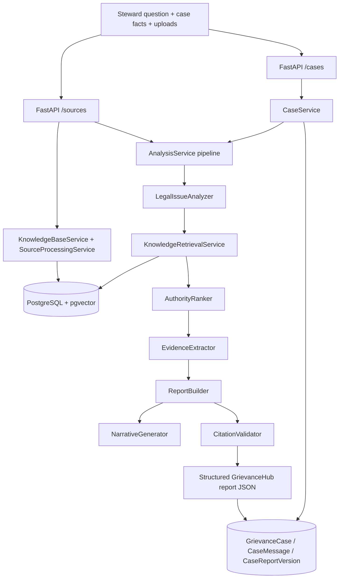

# GrievanceHub Project State

Last updated: 2026-07-01 (Phase 0 final stabilization)

## Architecture



**Stack:** Python 3.14, FastAPI, SQLAlchemy, Alembic, PostgreSQL 16 + pgvector (Docker), OpenAI embeddings (`text-embedding-3-small`), OpenAI chat (`gpt-4o-mini`).

**Indexed approved sources (live DB):** CONTRACT (National Agreement), CIM, ELM — **7 documents, ~1369 embedded chunks**.

**LMOU:** Approved in `AGENTS.md` but **not currently indexed** in the database. Retrieval and gap logic must **not** treat LMOU as available until documents are ingested and embedded.

**Authoritative specs:** Report section requirements in `AGENTS.md` and `app/schemas/report_schema.py` (`REPORT_SECTIONS`, `GrievanceHubReport`). Implementation phases tracked in this document.

---

## Codebase verification (2026-07-01)

**Git:** This workspace is **not** a Git repository (no `.git` directory). State was verified by filesystem inspection instead of `git status` / `git diff`.

**Confirmed present and aligned with documentation:**

| Area | Verification |
|------|----------------|
| Phase 0 retrieval/ranking | `app/retrieval_config.py`, `relevance_utils.py`, `knowledge_retrieval_service.py`, `authority_ranker.py`, `citation_validator.py`, `analysis_service.py` |
| Phase 1 report schema/narratives | `app/schemas/report_schema.py`, `narrative_generator.py`, `report_builder.py` |
| Phase 2 case sessions | `app/services/case_service.py`, `app/api/routes/cases.py`, `app/main.py` (cases router registered), Alembic `a1b2c3d4e5f6_add_grievance_case_tables.py` |
| Regression harness | `tests/fixtures/regression_questions.json` (8 questions), `tests/test_regression_harness.py`, `scripts/regression_report.py`, `scripts/diagnose_regression.py` |
| Live scorecard artifact | `data/reports/regression_scorecard.json` — **8 PASS / 0 PARTIAL / 0 FAIL** (`phase0_iteration2_verification`, 2026-07-01) |

No uncommitted code changes were detected beyond this documentation update (Git unavailable).

---

## Phase 0 — Final Stabilization Record

**Status:** Complete. Bounded repair loop exhausted (initial repair + Iteration 1 + Iteration 2). **No further Phase 0 implementation or regression cycles are planned.**

### Final regression scorecard

| Metric | Baseline | After initial repair | Iteration 1 | **Final (Iteration 2 verified)** |
|--------|----------|----------------------|-------------|-------------------------------------|
| **PASS** | 0 | 6 | 7 | **8** |
| **PARTIAL** | 5 | 2 | 1 | **0** |
| **FAIL** | 3 | 0 | 0 | **0** |

**Per-question final result (all PASS):**

| Q | Topic (summary) | Ranked authorities | Citation validation |
|---|-----------------|-------------------|---------------------|
| Q1 | Annual leave cancellation + information request | 3 | Passed |
| Q2 | Seven-day suspension without prior discipline | 7 | Passed |
| Q3 | Overtime list bypass (seniority) | 8 | Passed |
| Q4 | Supervisor performing BU work | 3 | Passed |
| Q5 | Schedule change with one-day notice | 7 | Passed |
| Q6 | Unsafe equipment / safety inspection | 2 | Passed |
| Q7 | Probationary termination + denied information | 4 | Passed |
| Q8 | Steward records / interview access denied | 3 | Passed |

**Verification method:** Live pipeline via FastAPI `TestClient` (in-process, no Uvicorn). Scorecard artifact: `data/reports/regression_scorecard.json` (`generated_at`: 2026-07-01T14:35:37Z, `finished_at`: 2026-07-01T14:50:13Z).

**Baseline before repair:** Q1–Q4 PARTIAL, Q5–Q6 FAIL, Q7–Q8 PARTIAL.

### Root causes identified

1. **False direction penalties** — `_frame_action_terms` tokenized full dispute-frame sentences (`employee`, `leave`, `approved`, …), penalizing governing chunks.
2. **Per-issue pool starvation** — Narrow issue keywords failed combined-score gate even when embedding similarity matched relevant CONTRACT/CIM text (Q1, Q5, Q6 returned **0** merged chunks).
3. **No global fallback retrieval** — Full-question embedding search was not merged when per-issue pools were empty.
4. **False retrieval gaps** — `missing_source_types` compared ranked authorities to `possible_sources` (often all four types), marking ELM/LMOU missing even when CONTRACT/CIM sufficed.
5. **Dispute frame corruption** — `_resolve_dispute_frame` briefly stringified dict frames, breaking direction scoring (fixed mid-cycle).
6. **Relevant content exists in DB** — Keyword probes confirmed governing text for failed scenarios; failures were scoring/gates, not absent index content.

### All files changed during Phase 0

**Created:**

| File | Purpose |
|------|---------|
| `app/services/narrative_generator.py` | Grounded report narratives (Phase 1; present before final Phase 0 pass) |
| `app/services/case_service.py` | Case sessions and versioned reports (Phase 2) |
| `app/api/routes/cases.py` | `/cases/*` REST API (Phase 2) |
| `scripts/diagnose_regression.py` | Full pipeline diagnostic per benchmark question |
| `scripts/regression_report.py` | Live scorecard + authority listing |
| `tests/fixtures/regression_questions.json` | Eight benchmark questions |
| `tests/test_relevance_phase0.py` | Direction, gate, global-keyword unit tests |
| `tests/test_narrative_generator.py` | Narrative generator unit tests |
| `tests/test_regression_harness.py` | `score_report_completeness` + live smoke |
| `tests/test_case_service.py` | Case service logic tests |
| `tests/test_retrieval_gaps.py` | Retrieval gap logic tests |
| `tests/test_authority_ranker_filters.py` | Coverage-floor unit tests (Iteration 2) |
| `pytest.ini` | Registers `integration` mark |
| `data/reports/regression_diagnosis.json` | Diagnostic output (generated) |
| `data/reports/regression_scorecard.json` | Scorecard output (generated) |

**Modified:**

| File | Phase | Changes |
|------|-------|---------|
| `app/retrieval_config.py` | 0 | `MIN_COMBINED_RETRIEVAL_SCORE=0.30`, `EMBEDDING_FALLBACK_THRESHOLD=0.68`, per-issue/ranker caps, direction/substantive weights |
| `app/services/relevance_utils.py` | 0 | Dispute-frame signals, `passes_retrieval_gate`, global keyword max-scoring, per-issue pool merge, safety query expansion; **Iter 1:** `build_issue_type_backfill_queries`; **Iter 2:** `extract_grounded_quote_snippet` |
| `app/services/legal_issue_analyzer.py` | 0 | `dispute_frame`, `information_rights_issues`, synonyms, `known_facts`, cache invalidation |
| `app/services/knowledge_retrieval_service.py` | 0 | Per-issue pools, global fallback, indexed source types, retrieval gaps; **Iter 1:** `_backfill_empty_issue_pools`, `_append_passing_chunks_to_pool` |
| `app/services/authority_ranker.py` | 0 | Dispute frame in prompt, direction post-filters, multi-issue coverage gaps; **Iter 2:** `_promote_per_issue_coverage_floor` |
| `app/services/citation_validator.py` | 0 | Validates all authority report sections |
| `app/services/analysis_service.py` | 0/1 | Retrieval gaps from `all_chunks`, dispute frame fix, gap/metadata passthrough |
| `app/schemas/report_schema.py` | 1 | Pydantic models + provenance |
| `app/services/report_builder.py` | 1 | Full report via `NarrativeGenerator`; no static tips/remedies |
| `app/services/legal_issue_identifier.py` | 1 | Dispute frame + `known_facts` in prompt |
| `app/services/evidence_extractor.py` | 0 | Issue context in prompt (minor) |
| `app/api/routes/sources.py` | 2 | Optional `case_uuid`; passes retrieval metadata to report |
| `app/main.py` | 2 | Registers cases router |

**Confirmation:** No benchmark-specific hard-coding (no fixed articles, pages, questions, or expected quotes).

### Major retrieval and ranking fixes completed

- **Direction scoring:** Phrase/action-verb signals instead of generic frame tokens; reduced false penalties on leave/schedule/safety chunks.
- **`passes_retrieval_gate()`:** Pass on combined score **or** strong embedding (≥0.68) **or** embedding + substantive content (≥0.25).
- **Global fallback retrieval:** Full question + expanded queries merged into best-matching issue pool when per-issue pools are thin.
- **Global keyword max-scoring:** Chunks scored with both issue-specific and question-level keywords; best score wins.
- **Retrieval gap repair:** `found_source_types` from retrieval pool (`all_chunks`); `missing_source_types` only for indexed types with zero retrieved chunks; LMOU excluded when not indexed.
- **Substantive bonus:** Trigger lowered from 0.5 to 0.25 on substantive score.
- **Safety query expansion:** Token-driven safety/inspection queries when issue text contains safety-related terms (general list, not question-specific).
- **Iteration 1 — issue-type empty-pool backfill:** After global fallback, empty decomposed-issue pools receive a second retrieval pass using general issue-type query templates; backfilled chunks tagged with `matched_issue_ids`.
- **Iteration 2 — ranker per-issue coverage floor:** After LLM ranking + post-filters, `_promote_per_issue_coverage_floor` promotes one gated candidate per uncovered decomposed issue (respects direction, grounding, citation, and relevance gates; no low-quality promotion).

### All tests passed

| Suite | Result | Notes |
|-------|--------|-------|
| Phase 0 focused | **15 passed** | `tests/test_authority_ranker_filters.py` (coverage floor) + `tests/test_relevance_phase0.py` |
| Full unit suite | **39 passed, 1 skipped** | `pytest tests/ -v` (prior full run) |
| Live regression harness | **8 PASS / 0 PARTIAL / 0 FAIL** | `RUN_REGRESSION=1 pytest tests/test_regression_harness.py::test_regression_live_pipeline_smoke` |

Test inventory (46 test functions across 10 test modules): `test_authority_ranker_filters` (4), `test_relevance_phase0` (13), `test_retrieval_gaps` (2), `test_regression_harness` (5), `test_case_service` (6), `test_narrative_generator` (5), `test_knowledge_retrieval_scoring` (2), `test_report_builder_inclusion` (2), `test_citation_validator` (2), `test_relevance_utils` (5). One integration test skipped unless `RUN_REGRESSION=1`.

### Known limitations (non-blocking)

- Some questions still have **empty report authority categories** (e.g. Q7 lacks dedicated remedy/timeline/union_supporting sections) even though the completeness rubric passes with ≥2 ranked authorities, key violations, zero gap burden, and passed citation validation.
- **Converted-regular / probationary nuance** for Q7 is not yet retrieved as a dedicated governing authority (information-rights and management-limiting authorities pass the rubric).
- **LMOU not indexed** — gap logic correctly excludes it; local provisions cannot be retrieved until ingestion.
- **ELM** is indexed but rarely surfaces as top authority for NPMHU benchmark questions; not a regression failure.
- Regression rubric measures **completeness and grounding**, not legal conclusion quality or steward-facing prose depth.

### Protected behavior — do not change without a verified defect

Future phases (3+) must **not** alter the following unless a new defect is reproduced on the live regression harness and fixed with general (non-benchmark-specific) logic:

| Protected area | Location | Rationale |
|----------------|----------|-----------|
| Relevance gate thresholds | `app/retrieval_config.py` | Baseline for 8/8 PASS scorecard |
| `passes_retrieval_gate()` OR-logic | `app/services/relevance_utils.py` | Prevents per-issue pool starvation |
| Direction scoring (phrase/action signals) | `app/services/relevance_utils.py` | Fixed false penalties on governing chunks |
| Per-issue pools + global fallback + issue-type backfill | `app/services/knowledge_retrieval_service.py` | Ensures chunks reach ranker for all issue types |
| `_promote_per_issue_coverage_floor` | `app/services/authority_ranker.py` | Q7 final PASS depends on per-issue coverage |
| Retrieval gap logic (`found_source_types` / indexed-only `missing_source_types`) | `knowledge_retrieval_service.py`, `analysis_service.py` | Eliminates false ELM/LMOU gap flags |
| `score_report_completeness` rubric | `tests/test_regression_harness.py` | Regression contract for PASS/PARTIAL/FAIL |
| Eight benchmark questions | `tests/fixtures/regression_questions.json` | Stable regression baseline |
| Approved source types only | `AGENTS.md`, providers | CONTRACT, CIM, ELM, LMOU — no MRS/JCAM/Step 4/etc. |
| No grievance-type hard-coding | All pipeline services | General issue-aware logic only |
| GrievanceHub branding | Report schema, narratives | Never CREA |
| Citation quote grounding | `app/services/citation_validator.py` | Quotes must exist in source excerpts |
| Structured report schema | `app/schemas/report_schema.py` | Required for Phase 3 HTML/PDF export |

### Phase 1 and Phase 2 — confirmed intact

- **Phase 1 (structured report + narratives):** Pydantic report schema (`GrievanceHubReport`, `REPORT_SECTIONS`), `NarrativeGenerator`, grounded `ReportBuilder`, provenance, expanded limitations/source references — **unchanged** in the final Phase 0 pass except retrieval-gap passthrough in `AnalysisService`.
- **Phase 2 (case sessions):** `CaseService`, `/cases/*` API, versioned `CaseReportVersion`, optional `case_uuid` on `/sources/report`, Alembic migration `a1b2c3d4e5f6` — **verified present**; not modified in Iteration 2.

Phases 3–5 (HTML/PDF export, grievance templates, frontend) **not started**.

### Recommended next phase

**Phase 3 — Report export and presentation:** HTML rendering, print CSS, and PDF export from the existing structured `GrievanceHubReport` JSON (`CaseReportVersion.report_data`). The backend schema and pipeline are stable; export layers should consume JSON without changing retrieval, ranking, or the regression rubric.

Optional depth improvements (converted-regular nuance retrieval, richer remedy/timeline sections) may proceed in parallel only if they do not regress the 8/8 scorecard.

---

## Tests and verification commands

```bash
docker compose up -d
venv\Scripts\python.exe -m alembic upgrade head
venv\Scripts\python.exe -m pytest tests/ -v --tb=short

set RUN_REGRESSION=1
venv\Scripts\python.exe -m pytest tests/test_regression_harness.py::test_regression_live_pipeline_smoke -v -s

venv\Scripts\python.exe scripts/diagnose_regression.py
venv\Scripts\python.exe scripts/regression_report.py
```

---

## File Map

| File | Role |
|------|------|
| `app/retrieval_config.py` | Thresholds and weights |
| `app/services/relevance_utils.py` | Scoring, direction, gates, pool merge |
| `app/services/knowledge_retrieval_service.py` | Per-issue + global retrieval |
| `app/services/authority_ranker.py` | LLM ranking + post-filters |
| `app/services/analysis_service.py` | Pipeline orchestration + retrieval gaps |
| `app/services/narrative_generator.py` | Grounded narrative sections |
| `app/services/report_builder.py` | Structured report assembly |
| `app/services/case_service.py` | Case sessions and versioned reports |
| `app/api/routes/cases.py` | Case REST API |
| `app/api/routes/sources.py` | Sources, search, `/sources/report` |
| `scripts/diagnose_regression.py` | Pipeline diagnostics |
| `scripts/regression_report.py` | Live scorecard |
| `tests/fixtures/regression_questions.json` | Eight benchmark questions |
| `tests/test_regression_harness.py` | Completeness scoring + live hook |
| `AGENTS.md` | Permanent agent instructions |
