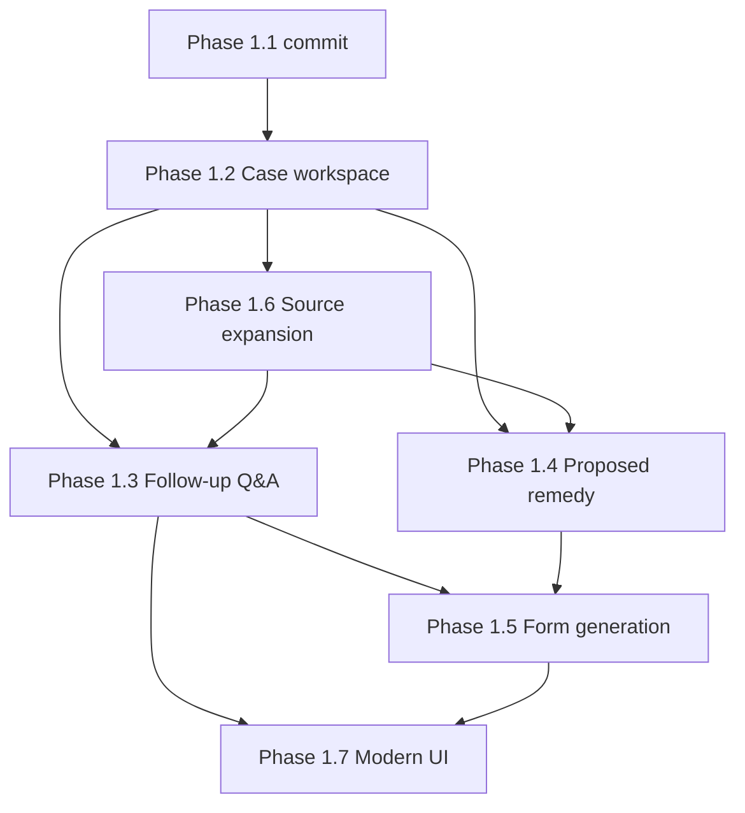

# Phase 1.2+ Implementation Plan — Case Workspace, Follow-Up Q&A, Report History, Proposed Remedies, and Grievance-Form Generation

**Prepared:** 2026-07-04  
**For:** Fresh agent implementing post–Phase 1.1 product work  
**Repository:** `C:\Users\tloll\Documents\GrievanceHub` (local-only)  
**Status:** Planning only — no implementation in this document

---

## Executive summary

Phase 1.1 stabilized the **GrievanceHub Analysis Report** foundation: honest source coverage, actor/action direction filters, separate National Agreement vs CIM citations, steward-readable limitations, and export wording repairs. Steward feedback (Dale, 2026-07-03) confirms the report quality direction is sound.

The next product increment is a **steward workflow**, not more retrieval tuning alone:

```
Upload documents
  → Generate report
  → Save report as a case/report instance
  → Steward reviews the report
  → Steward asks follow-up questions (optional)
  → Steward requests Step 1 / Step 2 / Step 3 grievance form (optional)
  → App fills official template from case facts + report + citations + proposed remedy
  → App asks for missing required fields (never invents them)
  → Steward reviews / edits / approves
  → Export PDF / DOCX
  → Save generated form under the same case history
```

**Critical constraint:** Grievance-form generation is **not** a standalone first step. It depends on a saved case with a reviewed report.

**Current backend state (verified 2026-07-04):**

| Area | Status |
|------|--------|
| Case persistence (`GrievanceCase`, `CaseMessage`, `CaseReportVersion`) | Implemented — PostgreSQL + Alembic `a1b2c3d4e5f6` |
| Case REST API (`/cases/*`) | Implemented — create, list, get, messages, facts, status, versions |
| Full pipeline on case create + every message | Implemented — **always** runs retrieval + report generation |
| Follow-up chat (grounded Q&A without full regen) | **Not implemented** |
| Case document upload + parsing | **Partial** — upload metadata in `message_metadata` only; no durable file store |
| Report HTML/PDF export | Implemented — read-only from saved `CaseReportVersion.report_data` |
| Proposed remedy when no explicit remedy authority | **Partial** — honest gap notice only; no practical proposed relief block |
| Grievance form generation | **Not implemented** — placeholder notice in `ReportBuilder.MATCHING_TEMPLATES_NOTICE` |
| Frontend / steward UI | **Not implemented** — API-only |
| LMOU indexed | **No** — provider exists; DB has 0 LMOU chunks |
| Arbitration / supervisor manuals | **No** — folder stubs in `SourceSyncService`; not in approved retrieval per `AGENTS.md` |

**Prerequisite:** Commit and merge Phase 1.1 (including retrieval-stability fixes verified 5/5) before starting Phase 1.2 implementation.

---

## A. Case workspace and report persistence

### A.1 Design goals

1. Every steward research session is a durable **case** with full audit trail.
2. Report versions are immutable snapshots; follow-up chat and form drafts are separate artifacts.
3. Uploaded case documents, parsed facts, retrieval audit, and exports are retrievable without re-running the pipeline.
4. Sensitive grievance data stays local (see Section H).

### A.2 Existing data model (keep and extend)

**Already in `app/database/models.py`:**

| Table | Purpose |
|-------|---------|
| `grievance_cases` | Session root: `case_uuid`, `title`, `initial_question`, `known_facts`, `status`, timestamps |
| `case_messages` | Conversation: `role`, `content`, `message_metadata` |
| `case_report_versions` | Versioned analysis: `report_data` (full AnalysisService wrapper JSON), `ranked_authorities`, `issue_analysis`, `evidence_items` |

**Already stored inside `CaseReportVersion.report_data` (via `AnalysisService.generate_report`):**

- Structured `GrievanceHubReport` (`app/schemas/report_schema.py`)
- `ranked_authorities`, `issue_analysis`, `evidence_items`
- `retrieval_gaps` (including `source_coverage_audit`, `unindexed_sources_requested`, `authority_topics_unavailable_in_index`)
- `citation_validation`

**Gaps to close:**

| Missing concept | Problem today | Target |
|-----------------|---------------|--------|
| Uploaded case documents | Only filenames in `message_metadata`; files not linked to case | Durable `CaseDocument` rows + local filesystem storage |
| Parsed facts from uploads | Not extracted/stored separately from `known_facts` | `parsed_facts` JSON on case or per-document |
| Proposed remedy (distinct) | Only `recommended_remedy` tied to `remedy_support` authorities | Explicit `proposed_remedy` object with grounding labels |
| Follow-up Q&A | Messages trigger full report regen | Chat messages with optional lightweight answers; report regen only when requested |
| Grievance forms | None | `CaseGrievanceForm` versions linked to report version + step level |
| Export audit | Exports are ephemeral HTTP responses | `CaseExport` log of generated files (optional file cache) |
| History list enrichment | Summary lacks articles, step level, chat/form flags | Denormalized summary fields or computed view |

### A.3 Proposed extended data model

Add tables via new Alembic migration(s). Prefer normalized tables over bloating `GrievanceCase` JSON.

#### `case_documents`

Stores steward-uploaded files for a case (distinct from national corpus `source_documents`).

```python
class CaseDocument(Base):
    __tablename__ = "case_documents"

    id: int                          # PK
    case_id: int                     # FK → grievance_cases.id
    document_uuid: str               # UUID, unique
    original_filename: str
    content_type: str                # application/pdf, image/jpeg, ...
    storage_path: str                # relative to DATA_DIR/case_uploads/{case_uuid}/
    sha256: str
    file_size_bytes: int
    upload_message_id: int | None    # FK → case_messages.id
    parse_status: str                # pending | parsed | failed | skipped
    parsed_text: str | None          # extracted plain text (local only)
    parsed_facts: dict | None        # structured extraction output
    parse_error: str | None
    sensitivity_level: str           # standard | confidential | redacted
    created_at: datetime
```

**Storage location (initial):**

- Filesystem: `data/case_uploads/{case_uuid}/{document_uuid}_{sanitized_filename}`
- Config constant: extend `app/config.py` with `CASE_UPLOAD_DIR = DATA_DIR / "case_uploads"`
- Never store case uploads inside indexed corpus paths (`uploads/contract`, etc.)

#### `case_report_versions` — add columns (migration)

```python
retrieval_gaps: Mapped[dict | None]          # snapshot of gaps at generation time
source_coverage_audit: Mapped[dict | None]   # denormalized audit for fast history UI
proposed_remedy: Mapped[dict | None]         # Phase 1.4; null until generated
report_summary: Mapped[dict | None]          # denormalized: primary_articles, issue_labels, authority_counts
```

Rationale: today `retrieval_gaps` is nested inside `report_data.report.limitations.retrieval_gaps` — extracting top-level columns avoids parsing deep JSON for list/history queries.

#### `case_chat_messages` (optional rename strategy)

**Option A (recommended):** Keep `case_messages` but add `message_type`:

```python
message_type: str  # user | assistant | system | report_regen_notice | form_field_prompt
intent: str | None # follow_up | regenerate_report | generate_form | upload | fact_update
linked_report_version_id: int | None
linked_form_id: int | None
citations: dict | None   # grounded citations for assistant replies
```

**Option B:** Separate `case_follow_up_messages` table — only if chat volume or schema divergence warrants it.

Use **Option A** to preserve existing `/cases/{uuid}/messages` routes with extended behavior.

#### `case_grievance_forms`

```python
class CaseGrievanceForm(Base):
    __tablename__ = "case_grievance_forms"

    id: int
    case_id: int
    form_uuid: str
    step_level: int                  # 1 | 2 | 3
    template_id: str                 # e.g. npmhu_step1_v2026
    template_version: str
    source_report_version_id: int    # FK → case_report_versions.id
    status: str                      # draft | pending_fields | ready | approved | exported
    field_values: dict               # merged steward + inferred values
    missing_required_fields: list    # [{field_id, label, reason}]
    generated_narrative: dict        # statement of facts, violations, remedy sections
    citations_snapshot: dict         # separate NA / CIM / ELM / LMOU / arbitration blocks
    steward_edits: dict | None       # diff from last auto-fill
    approved_at: datetime | None
    approved_by: str | None
    created_at: datetime
    updated_at: datetime
```

#### `case_exports`

```python
class CaseExport(Base):
    __tablename__ = "case_exports"

    id: int
    case_id: int
    export_uuid: str
    artifact_type: str       # report_html | report_pdf | form_pdf | form_docx
    related_report_version_id: int | None
    related_form_id: int | None
    filename: str
    storage_path: str | None  # optional cached copy under data/case_exports/
    mime_type: str
    created_at: datetime
```

#### `grievance_form_templates` (metadata registry; binary templates separate)

```python
class GrievanceFormTemplate(Base):
    __tablename__ = "grievance_form_templates"

    id: int
    template_id: str             # unique slug
    step_level: int
    title: str
    union: str                   # NPMHU
    effective_date: date | None
    file_path: str               # data/templates/grievance/npmhu_step1.docx
    file_format: str             # docx | pdf
    field_schema: dict           # required/optional fields, mappings — see Section E
    is_active: bool
    created_at: datetime
```

Template binaries live at `data/templates/grievance/` until user supplies official USPS/NPMHU forms.

### A.4 Canonical case aggregate (API view model)

Expose a single **`CaseWorkspace`** payload for UI and follow-up services:

```json
{
  "case_id": "uuid",
  "title": "...",
  "status": "open",
  "created_at": "...",
  "updated_at": "...",
  "initial_question": "...",
  "known_facts": {},
  "parsed_facts": {},
  "documents": [],
  "messages": [],
  "report_versions": [],
  "latest_report_version": 3,
  "latest_report": { "...": "full or summary" },
  "retrieved_authorities_summary": [],
  "source_audit": [],
  "source_gaps": {},
  "proposed_remedy": {},
  "grievance_forms": [],
  "exports": []
}
```

**Retrieval rules:**

| Data | Primary store | How loaded |
|------|---------------|------------|
| Case metadata | `grievance_cases` | `CaseService.get_case()` |
| Uploads | `case_documents` + filesystem | join by `case_id` |
| Report JSON | `case_report_versions.report_data` | latest or by version |
| Authorities | `case_report_versions.ranked_authorities` + report sections | version snapshot |
| Source audit / gaps | version columns or `report_data` | prefer denormalized columns |
| Proposed remedy | `case_report_versions.proposed_remedy` | Phase 1.4 |
| Chat | `case_messages` where `message_type != system` | chronological |
| Forms | `case_grievance_forms` | by case |
| Exports | `case_exports` | optional cache |

### A.5 Service layer changes (Phase 1.2)

Extend `app/services/case_service.py`:

| Method | Behavior |
|--------|----------|
| `create_case_with_report()` | Current create + v1 report; also persist audit snapshot columns |
| `upload_case_document()` | Save file, create `CaseDocument`, enqueue parse job (sync initially) |
| `get_case_workspace()` | Full aggregate for UI |
| `list_case_summaries()` | Enriched list with `primary_articles`, `has_follow_up`, `has_forms`, `latest_step_level` |
| `add_follow_up_message()` | **New** — does not regen report by default (Phase 1.3) |
| `regenerate_report()` | Explicit opt-in regen → new `CaseReportVersion` |

**Breaking change to address:** `POST /cases/{uuid}/messages` currently always calls `generate_report_version()`. Split into:

- `POST /cases/{uuid}/messages` — chat only (Phase 1.3)
- `POST /cases/{uuid}/reports/regenerate` — explicit new version (Phase 1.2)

Keep backward-compatible query flag temporarily: `?regenerate_report=true` for legacy clients.

### A.6 Initial storage strategy

| Tier | Technology | Contents |
|------|------------|----------|
| Structured | PostgreSQL 16 | Cases, messages, versions, forms, exports metadata |
| Case files | Local filesystem `data/case_uploads/` | PDFs, images, DOCX uploads |
| Template files | Local filesystem `data/templates/grievance/` | Official Step 1/2/3 templates (user-provided) |
| Export cache | Local filesystem `data/case_exports/` (optional) | Generated PDF/DOCX copies |
| National corpus | PostgreSQL + pgvector | CONTRACT, CIM, ELM (future: LMOU, ARBITRATION, SUPERVISOR_MANUAL) |

No cloud object storage in initial phases. Backup = `data/backups/` + DB dump (already referenced in config).

---

## B. Report / case history UI

### B.1 Context

There is **no frontend** in the repository today. Phase 1.2 delivers API contracts and a minimal static or lightweight SPA shell; Phase 1.7 completes the modern steward workflow UI.

### B.2 History list design

**Route:** `GET /cases` (extend response) or dedicated `GET /cases/history`

Each history card/row:

| Field | Source |
|-------|--------|
| Title / issue | `grievance_cases.title` or `report_summary.primary_issue` |
| Created date | `created_at` |
| Last updated | `updated_at` |
| Status | `open` / `closed` / `archived` |
| Main articles/issues | `report_summary.articles` e.g. `["CONTRACT Art. 10.5", "CIM Art. 31"]` |
| Step level | max `case_grievance_forms.step_level` if any form exists |
| Follow-up chat | `message_count > 1` or any assistant `message_type=follow_up` |
| Exported forms | `exports.count > 0` or `forms.status=exported` |
| Latest report version | `latest_report_version` |

**Computed at write time** (in `generate_report_version` and form save) into `report_summary` JSON:

```json
{
  "primary_issue": "Management revoked approved annual leave",
  "articles": ["CONTRACT 10.5", "CIM 31"],
  "source_types_found": ["CONTRACT", "CIM"],
  "authority_count": 2,
  "has_remedy_authority": false,
  "has_proposed_remedy": true
}
```

### B.3 History detail / reopen

**Route:** `GET /cases/{case_uuid}` → `CaseWorkspace` payload

UI sections:

1. **Header** — title, status, dates, steward name, local number
2. **Documents** — uploaded files with parse status
3. **Report** — latest version default; version picker for prior reports
4. **Chat** — follow-up thread (Phase 1.3)
5. **Forms** — Step 1/2/3 drafts and exports (Phase 1.5)
6. **Exports** — download links for HTML/PDF/DOCX

Actions:

- Reopen closed case → `PATCH /cases/{uuid}/status` `{ "status": "open" }`
- Export report → existing export routes
- Start follow-up → chat input
- Generate form → wizard (Phase 1.5)

### B.4 UI technology recommendation (Phase 1.2 minimal → 1.7 full)

| Phase | UI deliverable |
|-------|----------------|
| 1.2 | Server-rendered Jinja **case history page** at `/ui/cases` OR minimal Vite + vanilla/HTMX consuming JSON API |
| 1.7 | Full React/Vue steward workspace with document upload drag-drop, split-pane report + chat |

Prefer **same stack as report export (Jinja2)** for Phase 1.2 history list to avoid premature SPA complexity — but API-first so Phase 1.7 can replace templates.

**New files (Phase 1.2):**

- `app/templates/ui/case_history.html.j2`
- `app/templates/ui/case_detail.html.j2`
- `app/static/ui/case_workspace.css`
- `app/api/routes/ui_cases.py` (optional thin HTML routes)

---

## C. Follow-up Q&A

### C.1 Problem with current behavior

`POST /cases/{uuid}/messages` appends a message **and** runs the full `KnowledgeRetrievalService.search_all()` + `AnalysisService.generate_report()` pipeline. That is expensive, non-deterministic, and wrong for questions like *"What evidence am I missing?"* or *"Does Article 10.5 help here?"* which should answer from the **saved report context**.

### C.2 New service: `FollowUpChatService`

**File:** `app/services/follow_up_chat_service.py`

**Inputs (always loaded from case workspace):**

1. Saved report (latest or pinned version)
2. Uploaded document text / parsed facts
3. `ranked_authorities` snapshot
4. Source citations from report sections
5. `retrieval_gaps` + `source_coverage_audit`
6. Prior follow-up chat history
7. Optional expanded corpus search (Phase 1.6+) — gated and disclosed

**Outputs:**

```json
{
  "answer": "...",
  "answer_type": "fact | argument | citation | remedy | procedural | uncertainty | action",
  "citations": [{ "document_type": "CONTRACT", "article": "10.5", "quote": "...", "page": 44 }],
  "disclosures": ["No LMOU indexed", "No explicit remedy authority in saved report"],
  "suggested_actions": ["generate_step1_form"],
  "requires_report_regen": false
}
```

### C.3 Intent routing

Classify steward message (rules + lightweight LLM) into intents:

| Intent | Handler | Regen report? |
|--------|---------|---------------|
| `missing_evidence` | Report `detailed_analysis.evidence_to_gather` + gaps | No |
| `strengthen_argument` | Authorities + dispute frame; no new facts | No |
| `remedy_advice` | `proposed_remedy` + `remedy_authority` sections | No |
| `authority_lookup` | Saved citations first; optional targeted retrieval | Optional |
| `source_question` | "Is there anything in the CIM?" — saved + optional CIM-only search | Optional |
| `generate_form` | Delegate to `GrievanceFormService` (Phase 1.5) | No |
| `new_facts` | Update `known_facts`; suggest regen | Steward confirms |
| `full_reanalysis` | Explicit regen | Yes |

**API:**

```
POST /cases/{case_uuid}/chat
{
  "content": "What evidence am I missing?",
  "report_version": null,          // null = latest
  "allow_supplemental_retrieval": false
}
```

### C.4 Grounding and safety rules (mandatory)

1. **Cite sources** when relying on CONTRACT/CIM/ELM/LMOU/arbitration text — use saved report quotes first.
2. **Disclose uncertainty** — mirror Phase 1.1 limitations language.
3. **Never invent facts** — if not in `known_facts`, uploads, or steward messages, label as missing.
4. **Distinguish layers** in response structure:
   - **Facts** — from case record
   - **Arguments** — tied to authorities
   - **Citations** — verbatim quotes only
   - **Proposed remedies** — labeled separately from violation authority
5. **Supplemental retrieval** (optional flag): run narrow `KnowledgeRetrievalService` query; append disclosure that results were not in original report version.
6. **No external data transmission** beyond configured local OpenAI endpoint (Section H).

### C.5 Prompt assembly sketch

```
System: You are GrievanceHub follow-up assistant for NPMHU stewards.
Ground answers in CASE_CONTEXT only. Never invent grievant names, dates, or management actions.

CASE_CONTEXT:
- Initial question: ...
- Known facts: ...
- Parsed document facts: ...
- Quick assessment: ...
- Key violations (with quotes): ...
- Remedy authority: ...
- Proposed remedy: ...
- Limitations and source gaps: ...
- Source audit: ...
- Chat history: ...

Rules:
- Separate National Agreement and CIM citations.
- If asked about remedy and no remedy_authority exists, use proposed_remedy and disclose gap.
- If LMOU/arbitration not indexed, say so.
```

Use `gpt-4o-mini` initially (consistent with pipeline); consider local model path in Phase 1.7 security hardening.

### C.6 Example steward requests

| Request | Expected behavior |
|---------|-------------------|
| "What evidence am I missing?" | List from report + `facts_still_needed`; reference uploads |
| "Make the argument stronger." | Suggest additional tie-ins from saved authorities; no new legal claims |
| "What remedy should I request?" | `proposed_remedy` + explicit vs proposed labeling |
| "Does Article 10.5 help here?" | Quote saved CONTRACT 10.5 passage; explain relevance to dispute frame |
| "Is there anything in the CIM?" | List saved CIM authorities; disclose if none |
| "Generate a Step 1 grievance." | Start form wizard; do not auto-submit |

---

## D. Proposed remedy drafting

### D.1 Current behavior

`NarrativeGenerator.build_recommended_remedy()` (`app/services/narrative_generator.py`):

- Populates `statements` only from `remedy_support` authorities (`passage_expresses_remedy_relief()` gate in ranker).
- If none: sets `insufficient_notice` — *"No remedy_support authority was retrieved..."*
- Does **not** propose practical relief based on violation + harm.

Export layer (`text_formatter.format_recommended_remedy_display`) sanitizes overstatements but does not add proposed relief.

### D.2 Required distinction (four layers)

| Layer | Report section | Grounding rule |
|-------|----------------|----------------|
| Violation authority | `key_contract_violations`, `union_supporting_authority` | Must have grounded quote |
| Procedural / information authority | `procedural_requirements`, `information_rights`, `timeline_requirements` | Must have grounded quote |
| Explicit remedy authority | `remedy_authority` | Only `remedy_support` with relief language |
| Proposed / requested remedy | **New:** `proposed_remedy` + enhanced `recommended_remedy` | Practical relief derived from violations + harm; **labeled proposed** |

### D.3 Schema extension

Add to `app/schemas/report_schema.py`:

```python
class ProposedRemedy(BaseModel):
    label: str = "Proposed requested relief (not grounded in explicit remedy authority)"
    statements: list[str]
    basis: list[str]              # violation summaries referenced
    grounding_authorities: list[str]  # violation/procedural cites, NOT remedy_support
    explicit_remedy_authority_found: bool
    steward_confirmation_notice: str
    provenance: Provenance | None = None
```

Add field on `GrievanceHubReport`:

```python
proposed_remedy: ProposedRemedy | None = None
```

### D.4 Generation logic (Phase 1.4)

**File:** `app/services/proposed_remedy_service.py`

Algorithm (general — no Article 10 hard-coding):

1. Collect violation and harm signals from `dispute_frame`, `key_contract_violations`, `known_facts`.
2. If `remedy_authority` non-empty → `recommended_remedy` stays authority-grounded; `proposed_remedy` may duplicate or stay null.
3. If `remedy_authority` empty:
   - Build proposed relief templates from **issue type** (leave, discipline, schedule, information, etc.) using dynamic phrase patterns, not fixed outcomes.
   - Include standard steward blocks: cease and desist, make whole, record correction, information production.
   - Append confirmation notice referencing LMOU, arbitration, past practice (with honest unindexed disclosure).

**Example output style** (from user requirements):

> No directly matching remedy authority was located in the currently indexed sources. Based on the alleged violation and harm, the steward may consider requesting that management cease and desist from failing to honor approved annual-leave commitments except in serious emergency situations; that the grievant be made whole for any losses suffered; that any leave, pay, scheduling, or record corrections be made as appropriate; and that management provide the union all requested information necessary to investigate and process the grievance. Steward should confirm applicable LMOU, arbitration, past-practice, or settlement authority before final submission.

4. **Never** state the grievance has no remedy solely because no explicit remedy authority was retrieved (Phase 1.1 requirement — preserve).

### D.5 Export presentation

Update `format_recommended_remedy_display` and HTML template:

- Section **Recommended Remedy** — explicit authority-grounded relief only
- Subsection **Proposed Requested Relief** — when no explicit remedy authority; visually distinct (e.g., bordered callout)
- Clear label: *"Proposed — confirm before filing"*

### D.6 Tests

- `tests/test_proposed_remedy_service.py` — leave revocation scenario: no `remedy_authority`, non-empty `proposed_remedy`, contains confirmation notice
- Extend `tests/test_phase1_1_source_coverage.py` — ensure proposed remedy does not claim explicit authority
- Export tests — proposed remedy renders in HTML/PDF

---

## E. Step 1 / Step 2 / Step 3 grievance form generation

### E.1 Prerequisites (hard gates)

1. Case exists with at least one `CaseReportVersion`.
2. Steward has reviewed report (UI acknowledgment checkbox optional).
3. Official templates registered in `grievance_form_templates` (user must supply files).
4. Required grievant/installation fields collected — **prompt, never invent**.

### E.2 Template registry

User will provide official Step 1, Step 2, Step 3 templates later.

**Initial setup:**

```
data/templates/grievance/
  npmhu_step1_v1.docx      # placeholder until official
  npmhu_step2_v1.docx
  npmhu_step3_v1.docx
  schemas/
    npmhu_step1_v1.json    # field schema
```

**Field schema example** (`schemas/npmhu_step1_v1.json`):

```json
{
  "template_id": "npmhu_step1_v1",
  "step_level": 1,
  "required_fields": [
    { "id": "grievant_name", "label": "Grievant name", "source": "steward_input" },
    { "id": "grievant_ein", "label": "EIN", "source": "steward_input" },
    { "id": "installation", "label": "Installation", "source": "case.local_number|steward_input" },
    { "id": "date_of_violation", "label": "Date of violation", "source": "known_facts|steward_input" },
    { "id": "statement_of_facts", "label": "Statement of facts", "source": "generated_from_report" },
    { "id": "articles_violated", "label": "Articles violated", "source": "generated_from_citations" },
    { "id": "remedy_requested", "label": "Remedy requested", "source": "proposed_remedy|remedy_authority" }
  ],
  "optional_fields": [...],
  "docx_bookmarks": {
    "grievant_name": "BM_GrievantName",
    "statement_of_facts": "BM_Facts"
  }
}
```

### E.3 Service: `GrievanceFormService`

**File:** `app/services/grievance_form_service.py`

| Method | Purpose |
|--------|---------|
| `list_available_templates(step_level)` | Active templates |
| `start_form(case_uuid, step_level, report_version)` | Create draft; auto-fill inferable fields |
| `get_missing_fields(form_uuid)` | Required fields still empty |
| `update_fields(form_uuid, fields)` | Steward edits |
| `generate_narrative_sections(form_uuid)` | Facts, violations, remedy from report |
| `render_preview(form_uuid)` | HTML preview |
| `export_docx(form_uuid)` | Fill template via python-docx or docxtpl |
| `export_pdf(form_uuid)` | DOCX → PDF (WeasyPrint or libreoffice headless — local only) |
| `approve_form(form_uuid)` | Lock for filing |

**Auto-fill sources (priority order):**

1. Steward-provided field values
2. `known_facts` / `parsed_facts`
3. Report narratives (facts, violations)
4. Citations — **separate blocks** per source type (CONTRACT, CIM, ELM, LMOU, ARBITRATION)
5. `proposed_remedy` or explicit `remedy_authority`

**Never auto-fill:** grievant name, EIN, SSN, dates not in facts, supervisor names unless in uploads.

### E.4 Citation formatting in forms

Reuse `app/services/report_export/citation_formatter.py` logic:

```
National Agreement: Article 10.5 (p. 44) — "All advance commitments..."
CIM: Article 31 (p. 468) — "Upon the written request of the Union..."
```

Do not merge into single "Contract/CIM" line.

### E.5 API routes (Phase 1.5)

```
GET  /cases/{case_uuid}/forms/templates?step=1
POST /cases/{case_uuid}/forms                    { "step_level": 1, "report_version": 2 }
GET  /cases/{case_uuid}/forms/{form_uuid}
PATCH /cases/{case_uuid}/forms/{form_uuid}/fields
POST /cases/{case_uuid}/forms/{form_uuid}/generate-narrative
GET  /cases/{case_uuid}/forms/{form_uuid}/export/preview
GET  /cases/{case_uuid}/forms/{form_uuid}/export/docx
GET  /cases/{case_uuid}/forms/{form_uuid}/export/pdf
POST /cases/{case_uuid}/forms/{form_uuid}/approve
```

### E.6 Workflow integration

Follow-up chat intent `generate_form` → returns missing fields form schema → UI modal → creates `CaseGrievanceForm`.

Saved under same case; appears in history with `step_level` badge.

### E.7 Dependencies

- `python-docx` or `docxtpl` for DOCX fill
- WeasyPrint (already used for report PDF) for form PDF if HTML intermediate
- Template binaries from user — **block Phase 1.5 acceptance** until at least one real template schema is validated against official form

---

## F. Data-source expansion

### F.1 Policy note

`AGENTS.md` currently lists approved types: CONTRACT, CIM, ELM, LMOU — and explicitly says **do not add** arbitrations, Step 4, etc. Steward feedback requests arbitrations, LMOU, and supervisor manuals.

**Phase 1.6 must include an `AGENTS.md` amendment** approved by the user defining:

- `ARBITRATION` — local/national awards as persuasive/precedent sources
- `SUPERVISOR_MANUAL` — operational guidance (lowest hierarchy)
- `LOCAL_SETTLEMENT` or `PAST_PRACTICE` — optional future type

Until amended, ingestion code may be built behind feature flags but must not activate in production retrieval.

### F.2 Source type definitions

| source_type | Title examples | binding_status | hierarchy rank |
|-------------|----------------|----------------|----------------|
| CONTRACT | National Agreement | controlling | 1 |
| CIM | Contract Interpretation Manual | high authority interpretation | 2 |
| ELM | Employee and Labor Relations Manual | policy/manual | 3 |
| LMOU | Local MOU | local contractual | 4 |
| ARBITRATION | Arbitration award | precedent/persuasive | 5 |
| SUPERVISOR_MANUAL | Supervisor's Manual / MRS-like ops guide | operational guidance | 6 |
| LOCAL_SETTLEMENT | Step settlement / past practice doc | local support | 7 |

### F.3 Extended chunk metadata

Extend `SourceChunk` or parallel `source_chunk_metadata` JSON:

| Field | Purpose |
|-------|---------|
| `source_type` | CONTRACT, CIM, ... |
| `title` | Document title |
| `article` | Article number |
| `section` | Section label |
| `issue` | Tagged issue (leave, discipline, ...) |
| `facility_locality` | Plant/installation for local docs |
| `date` | Award date / MOU effective date |
| `page` | Page number (existing) |
| `binding_status` | controlling \| interpretive \| persuasive \| guidance |
| `local_national_status` | local \| national |
| `precedential_value` | high \| medium \| low \| none |
| `remedy_language` | bool — chunk contains relief text |
| `management_defense_language` | bool |
| `related_contract_article` | cross-ref |
| `related_cim_section` | cross-ref |
| `related_elm_section` | cross-ref |
| `related_lmou_section` | cross-ref |
| `sensitivity_level` | public \| union_confidential \| pii_risk |
| `redaction_status` | none \| partial \| full |

Populate during ingestion in `SourceProcessingService` (extend existing PDF chunk pipeline).

### F.4 Ingestion plan per type

#### LMOU (first priority — already in provider layer)

- Path: `uploads/lmou/*.pdf`
- Provider: `LMOUProvider` exists
- Work: ingest local MOU PDFs, embed, add to `indexed_source_types`
- Update gap logic: remove LMOU from `unindexed_sources_requested` when indexed
- Metadata: `facility_locality`, `local_national_status=local`

#### ARBITRATION

- Path: `uploads/arbitration/` (stub exists in `SourceSyncService`)
- New: `ArbitrationProvider` mirroring base provider pattern
- **Redaction workflow required** before embedding (Section H)
- Ranker role: new `arbitration_precedent` — never overrides CONTRACT/CIM violation text
- Feature flag: `RETRIEVAL_ENABLE_ARBITRATION=0` until AGENTS.md updated

#### SUPERVISOR_MANUAL

- Path: `uploads/supervisor_manual/`
- New: `SupervisorManualProvider`
- Ranker: `operational_guidance` — cite separately; disclose lower authority
- Often overlaps ELM — direction filters must prevent override

#### LOCAL_SETTLEMENT / PAST_PRACTICE (later)

- Path: `uploads/local_settlements/`
- Same ingestion framework; highest sensitivity

### F.5 Files likely affected (Phase 1.6)

- `app/services/providers/` — new providers
- `app/services/knowledge_retrieval_service.py` — register providers
- `app/services/authority_ranker.py` — new roles + hierarchy post-filter
- `app/services/relevance_utils.py` — hierarchy enforcement helpers
- `app/retrieval_config.py` — per-type caps
- `app/database/models.py` — chunk metadata
- `AGENTS.md` — approved source list update

---

## G. Source ranking and citation rules

### G.1 Hierarchy (mandatory)

1. **National Agreement (CONTRACT)** — controlling contract language  
2. **CIM** — high-authority interpretation; never merged with CONTRACT citations  
3. **ELM** — USPS manual / policy  
4. **LMOU** — local contractual rules  
5. **ARBITRATION** — precedent / remedy / fact-pattern  
6. **SUPERVISOR_MANUAL** — operational guidance  
7. **PAST_PRACTICE / SETTLEMENTS** — local support where documented  

### G.2 Citation rules (implement across report, chat, forms, export)

| Rule | Enforcement location |
|------|---------------------|
| NA and CIM cited separately | `citation_formatter.py`, `FollowUpChatService`, `GrievanceFormService` |
| Weaker sources cannot override CONTRACT/CIM violation text | `authority_ranker.py` post-filter `_enforce_source_hierarchy()` |
| Both NA + CIM support same issue → show both as related separate authorities | `report_builder.py`, export `presentation.py` |
| Language from NA → cite NA only | Ranker + narrative prompts |
| Language from CIM → cite CIM only | Ranker + narrative prompts |
| Arbitration for remedy only when no controlling remedy in NA/CIM | `proposed_remedy_service.py` + ranker role caps |

### G.3 New ranker post-filter (Phase 1.6)

```python
def _enforce_source_hierarchy(ranked: list[dict]) -> list[dict]:
    """
    If CONTRACT passage governs violation standard, demote or relabel
    SUPERVISOR_MANUAL / ARBITRATION passages that contradict it.
    Never remove management_limiting authorities.
    """
```

### G.4 Existing export support

Phase 3 export already:

- Groups citations by document type (`presentation.py`, `citation_formatter.py`)
- Sanitizes remedy overstatements (`text_formatter.py`)
- Formats source coverage caveats per source type

Extend for new source types with display labels:

| source_type | Steward label |
|-------------|---------------|
| CONTRACT | National Agreement |
| CIM | CIM |
| ELM | ELM |
| LMOU | LMOU |
| ARBITRATION | Arbitration award |
| SUPERVISOR_MANUAL | Supervisor manual |

---

## H. Security and sensitive data

### H.1 Local-only processing assumptions

GrievanceHub is designed for **local steward machines** or union-controlled servers:

- PostgreSQL runs locally (Docker)
- Case uploads and exports stay under `data/`
- No remote git remote configured today
- OpenAI API calls: **currently required** for embeddings and LLM — treat as sensitive channel

### H.2 Data that must never leave the local environment (ideal target)

| Data class | Examples | Policy |
|------------|----------|--------|
| Grievant PII | Name, EIN, address, medical | Never in LLM prompts unless steward opts in per message |
| Case uploads | Discipline letters, leave approvals | Local storage; redact before embedding if used for retrieval |
| Full arbitration awards | Names, settlements | Redact before index; sensitivity metadata |
| Generated forms pre-approval | Step 1 drafts | Local only |

**Phase 1.7:** Optional `LOCAL_LLM_ONLY=1` mode disabling external API for follow-up chat (future).

### H.3 Redaction needs

Before indexing **ARBITRATION** or **LOCAL_SETTLEMENT**:

1. Steward upload → `redaction_status=pending`
2. Manual or assisted redaction UI — remove grievant/management names, EIN
3. Store redacted PDF + original encrypted separately (`data/case_uploads/` vs `data/sources/redacted/`)
4. Only redacted text embedded

### H.4 Access controls (phased)

| Phase | Control |
|-------|---------|
| 1.2 | Case UUID secrecy; no auth (development — same as export routes) |
| 1.7 | Steward login; case ownership by `user_id`; local/session auth |
| Future | Role-based: steward vs admin; audit log read restricted |

Implement stub now: `ReportExportService._authorize_export()` → extend to `CaseAccessService.check_case_access(steward_id, case_uuid)`.

### H.5 Audit logs

**New table:** `audit_events`

```python
event_type: str   # case_created | report_generated | form_exported | document_uploaded | chat_message | login
case_id: int | None
user_id: str | None
metadata: dict    # no PII in metadata unless required
ip_address: str | None
created_at: datetime
```

Log all exports and form approvals.

### H.6 Source visibility rules

| Source sensitivity | Visible to |
|--------------------|------------|
| CONTRACT, CIM, ELM national | All stewards |
| LMOU local | Stewards with matching `local_number` |
| Arbitration (redacted) | Union stewards |
| Arbitration (unredacted original) | Never embedded — filesystem ACL only |

Enforce in retrieval query filters: `organization_id` / `local_number` match for LMOU.

### H.7 PII handling in LLM prompts

- `FollowUpChatService`: strip EIN/SSN patterns from prompts unless field explicitly needed
- `GrievanceFormService`: pass only required fields to LLM for narrative generation
- Log scrubbing: no full prompts in production logs

---

## I. Recommended implementation phases

### Phase 1.2 — Case workspace, report persistence, history UI

**Objective:** Durable case workspace with document uploads, enriched persistence, history list/detail UI, and decoupled report regen endpoint.

| Area | Details |
|------|---------|
| **Files likely affected** | `app/database/models.py`, new Alembic migration, `app/services/case_service.py`, `app/services/case_document_service.py` (new), `app/api/routes/cases.py`, `app/api/routes/ui_cases.py` (new), `app/templates/ui/*`, `app/config.py`, `tests/test_case_service.py`, `tests/test_case_documents.py` (new) |
| **Data model** | `case_documents`; `case_report_versions.retrieval_gaps`, `source_coverage_audit`, `report_summary`; extend `case_messages.message_type` |
| **API** | `POST /cases/{uuid}/documents`, `GET /cases/{uuid}/workspace`, `POST /cases/{uuid}/reports/regenerate`, enriched `GET /cases` |
| **UI** | Case history list + detail pages (Jinja minimal) |
| **Tests** | Document upload, workspace aggregate, summary fields, regen creates new version without chat |
| **Acceptance criteria** | Steward can create case, upload PDF, view history list with dates/status/articles, reopen case, export saved report HTML/PDF without re-running pipeline |
| **Risks** | Filesystem storage on Windows paths; large PDF parse memory — cap file size (e.g., 25 MB) |

---

### Phase 1.3 — Follow-up Q&A grounded in saved report

**Objective:** Chat endpoint answering from saved report context without mandatory full regen.

| Area | Details |
|------|---------|
| **Files** | `app/services/follow_up_chat_service.py` (new), `app/api/routes/cases.py`, `app/schemas/follow_up_schema.py` (new), `tests/test_follow_up_chat.py` (new) |
| **Data model** | `case_messages.intent`, `citations`, `linked_report_version_id` |
| **API** | `POST /cases/{uuid}/chat`; change default `POST /messages` to chat-only |
| **UI** | Chat panel on case detail page |
| **Tests** | Missing evidence question uses report only; authority question cites saved quote; no hallucinated facts; supplemental retrieval disclosed |
| **Acceptance criteria** | All example steward requests in Section C.6 answered without regen; citations trace to saved report |
| **Risks** | LLM drift — mitigate with structured output + citation-required mode |

---

### Phase 1.4 — Proposed remedy drafting

**Objective:** Practical proposed relief when no explicit remedy authority; preserve violation vs remedy distinction.

| Area | Details |
|------|---------|
| **Files** | `app/services/proposed_remedy_service.py` (new), `app/services/narrative_generator.py`, `app/services/report_builder.py`, `app/schemas/report_schema.py`, export `text_formatter.py`, `grievancehub_report.html.j2`, `tests/test_proposed_remedy_service.py` |
| **Data model** | `case_report_versions.proposed_remedy` column |
| **API** | Included in report payload automatically |
| **UI** | Distinct "Proposed requested relief" callout in report view |
| **Tests** | Frozen leave question: proposed remedy present, no false explicit authority; export renders correctly |
| **Acceptance criteria** | Matches user example style; never says "no remedy" solely due to missing remedy authority |
| **Risks** | Over-specific proposed language — keep issue-type templates general |

---

### Phase 1.5 — Step 1/2/3 grievance form generation

**Objective:** Template-based form fill after case/report exists; missing-field prompts; PDF/DOCX export; saved under case.

| Area | Details |
|------|---------|
| **Files** | `app/services/grievance_form_service.py`, `app/services/grievance_form_export.py`, `app/api/routes/grievance_forms.py`, `data/templates/grievance/`, `tests/test_grievance_form_service.py` |
| **Data model** | `case_grievance_forms`, `grievance_form_templates`, `case_exports` |
| **API** | Form CRUD + export routes (Section E.5) |
| **UI** | Form wizard: step picker → missing fields → preview → approve → export |
| **Tests** | Auto-fill from report; refuses missing grievant name; separate citation blocks; DOCX bookmark fill |
| **Acceptance criteria** | End-to-end workflow Section E.1 satisfied with user-supplied template; form appears in case history |
| **Risks** | **Blocked on official templates** — use JSON schema + mock DOCX for dev only |

---

### Phase 1.6 — Arbitration / LMOU / supervisor-manual ingestion

**Objective:** Expand corpus with metadata, hierarchy ranker rules, redaction path, AGENTS.md update.

| Area | Details |
|------|---------|
| **Files** | Providers, `SourceProcessingService`, `authority_ranker.py`, `relevance_utils.py`, `AGENTS.md`, ingestion scripts |
| **Data model** | Chunk metadata JSON; optional `source_document.sensitivity_level` |
| **API** | Admin ingest routes (extend `/sources/upload-pdf/`) |
| **UI** | Source admin panel (minimal) |
| **Tests** | LMOU retrieval removes unindexed gap; arbitration cannot override CONTRACT; supervisor manual labeled low authority |
| **Acceptance criteria** | Steward questions referencing local MOU retrieve LMOU when indexed; hierarchy rules in Section G enforced |
| **Risks** | AGENTS.md conflict until user approves; sensitive data in arbitration PDFs |

---

### Phase 1.7 — Modern steward UI workflow

**Objective:** Full workflow UI: upload → report → review → chat → form → export in one workspace.

| Area | Details |
|------|---------|
| **Files** | New frontend app (`frontend/` or integrated SPA), auth module, `CaseAccessService`, audit logging |
| **Data model** | `users`, `audit_events`, case ownership |
| **API** | Auth middleware on all case/export routes |
| **UI** | Split pane: documents | report | chat | forms; mobile-friendly |
| **Tests** | E2E workflow test; auth denial; audit log entries |
| **Acceptance criteria** | Complete user workflow in Background section runnable without curl |
| **Risks** | Scope creep — keep MVP to single steward local auth first |

---

## Dependency graph



**Parallelization:** Phase 1.4 (proposed remedy) can run in parallel with 1.3 after 1.2. Phase 1.6 can start ingestion infrastructure in parallel with 1.3–1.5 but should not alter protected Phase 0/1.1 retrieval behavior without regression verification.

---

## Open questions (must answer before implementation)

1. **Official grievance templates:** When will NPMHU Step 1, Step 2, and Step 3 official DOCX/PDF templates be provided? Phase 1.5 acceptance is blocked without them.

2. **AGENTS.md amendment:** Does the user approve adding `ARBITRATION`, `SUPERVISOR_MANUAL`, and optionally `LOCAL_SETTLEMENT` as searchable source types, superseding the current "do not add arbitrations" rule?

3. **OpenAI vs local LLM:** Is continued use of OpenAI API acceptable for follow-up chat and form narrative generation, or must Phase 1.3+ support an offline/local model before deployment?

4. **Authentication timeline:** Is Phase 1.7 auth acceptable for local single-steward use, or is multi-steward auth required before any real case data is stored?

5. **LMOU scope:** Which local MOU document(s) should be ingested first? One per `local_number` or a national template?

6. **Arbitration redaction:** Manual redaction workflow vs automated PII scrubbing — who performs redaction before indexing?

7. **Report regen policy:** On new facts in follow-up chat, should the app auto-suggest regen, or require explicit steward confirmation always?

8. **Case message breaking change:** OK to change `POST /cases/{uuid}/messages` default from regen-to-chat-only with opt-in `regenerate_report=true`?

9. **Phase 1.1 commit:** Confirm branch `phase1-1-source-coverage-remedy` is approved for commit to `master` before Phase 1.2 branch creation.

10. **Supervisor manuals:** Which specific supervisor manual(s) (MRS, S-916, etc.) are in scope — are they union-approved sources or reference-only?

---

## Reference — current key files

| Concern | Path |
|---------|------|
| Case models | `app/database/models.py` |
| Case service | `app/services/case_service.py` |
| Case API | `app/api/routes/cases.py` |
| Analysis pipeline | `app/services/analysis_service.py` |
| Retrieval + source audit | `app/services/knowledge_retrieval_service.py` |
| Ranking | `app/services/authority_ranker.py` |
| Report build | `app/services/report_builder.py`, `narrative_generator.py` |
| Remedy (current) | `narrative_generator.build_recommended_remedy` |
| Citations | `app/services/citation_validator.py` |
| Report schema | `app/schemas/report_schema.py` |
| HTML/PDF export | `app/services/report_export_service.py`, `app/services/report_export/*` |
| Export routes | `app/api/routes/exports.py` |
| Agent rules | `AGENTS.md` |
| Project state | `PROJECT_STATE.md` |

---

## Confirmation

| Item | Status |
|------|--------|
| Implementation code modified | **No** |
| Git commit | **No** |
| Merge / push / upload / publish / deploy / sync | **No** |
| HTTP server started | **No** |
| External transmission of grievance data | **No** |

This document is planning-only. A fresh agent should start with Phase 1.2 after Phase 1.1 commit approval and user answers to open questions above.
